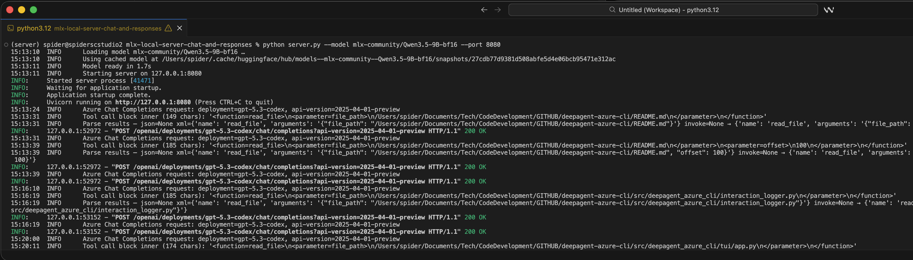
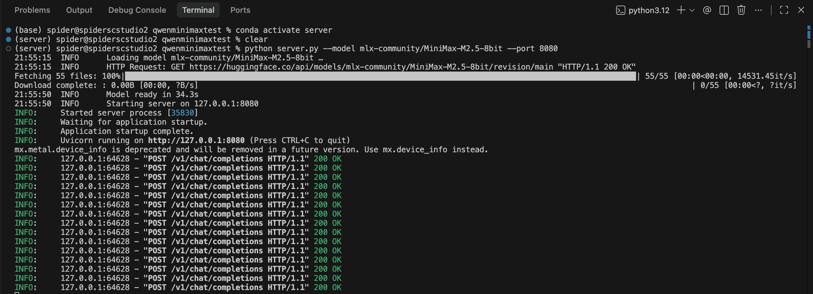

# MLX Local Inference Server

  -green)    

An OpenAI-compatible local inference server for Apple Silicon using [MLX](https://github.com/ml-explore/mlx). Drop-in replacement for any app that speaks the OpenAI protocol.

## Emulated APIs

| Provider | API | Endpoint(s) | Status |
|---|---|---|---|
| **OpenAI** | Chat Completions | `/v1/chat/completions` | Available |
| **OpenAI** | Responses | `/v1/responses` | Available |
| **Azure OpenAI** | Chat Completions | `/openai/deployments/{deployment}/chat/completions` | Available |
| **Azure OpenAI** | Responses | `/openai/deployments/{deployment}/responses` | Available |
| **Anthropic** | Messages | `/v1/messages` | Available |



## Project Structure

```
mlx_server/             # Core package
  app.py                # FastAPI app factory, middleware, error handling
  model.py              # ModelHolder singleton, model loading, inference lock
  schemas.py            # Pydantic request/response models (Chat, Responses, Anthropic)
  routes.py             # All endpoint handlers (health, chat, responses, anthropic, azure)
  prompt.py             # Chat template building, input conversion
  tool_parsing.py       # Multi-format tool call extraction
  postprocess.py        # Think-tag stripping, channel format handling
  streaming.py          # StreamFilter for token-level output processing
  conversation.py       # In-memory conversation store with TTL + archiving
server.py               # CLI entry point (args, model load, uvicorn)
tests/
  test_server.py        # Integration tests (requires running server)
  test_anthropic.py     # Anthropic Messages API tests
```

## Features



- **OpenAI Chat Completions API** (`/v1/chat/completions`) — streaming and non-streaming
- **OpenAI Responses API** (`/v1/responses`) — streaming and non-streaming, with multi-turn conversation via `previous_response_id`
- **Anthropic Messages API** (`/v1/messages`) — streaming and non-streaming, compatible with the Anthropic Python SDK
- **Tool/Function Calling** — full round-trip support: model emits structured tool calls, client executes tools, results fed back to model for final response. Works in both streaming and non-streaming modes across both APIs. Supports Qwen3 JSON format (`<tool_call>{"name":...}</tool_call>`) and Qwen3.5 XML format (`<tool_call><function=NAME><parameter=KEY>VALUE</parameter></function></tool_call>`)
- **`/v1/models`** — model discovery endpoint
- **`/health`** — readiness probe
- **Multi-turn conversation store** — in-memory with 1-hour TTL, auto-archiving expired conversations to `conversation_logs/` as JSON
- **Think-tag stripping** — removes `<think>...</think>` reasoning blocks from model output
- **Inference lock** — serializes requests so concurrent callers queue cleanly instead of corrupting MLX GPU state
- **CORS enabled** — browser-based apps can call it directly
- **Pydantic validation** — malformed requests get clear 422 errors
- **Structured error responses** — OpenAI-style error JSON on failures
- **Chat templates** — automatically applied from the model's tokenizer
- **Configurable** — temperature, top_p, max_tokens, stop sequences, repetition_penalty

### Chat Completions parameters

| Parameter | Default | Notes |
|---|---|---|
| `model` | loaded model | Ignored for routing; echoed back in the response |
| `messages` | required | Standard role/content message list (string, list-of-parts, or null content supported) |
| `temperature` | 0.7 | 0.0–2.0 |
| `top_p` | 0.95 | 0.0–1.0 |
| `max_tokens` | 4096 | |
| `stream` | false | SSE streaming |
| `stop` | none | String or list of stop sequences |
| `repetition_penalty` | 1.0 | |
| `tools` | none | List of tool/function definitions (OpenAI format) |
| `tool_choice` | none | `"none"` to suppress tool use, `"auto"` or omit for model discretion |

### Responses API parameters

| Parameter | Default | Notes |
|---|---|---|
| `model` | loaded model | Ignored for routing; echoed back in the response |
| `input` | required | String or message list (supports inline conversation history, multi-part content, and `function_call_output` items for tool results) |
| `instructions` | none | System prompt |
| `previous_response_id` | none | Chain multi-turn conversations |
| `temperature` | 0.7 | 0.0–2.0 |
| `top_p` | 0.95 | 0.0–1.0 |
| `max_output_tokens` | 4096 | |
| `stream` | false | SSE streaming |
| `tools` | none | List of tool definitions (flat format: `{type, name, description, parameters}`) |

Extra fields sent by OpenAI clients (like `presence_penalty`, `frequency_penalty`, etc.) are silently ignored so nothing breaks.

### Anthropic Messages API parameters

| Parameter | Default | Notes |
|---|---|---|
| `model` | loaded model | Ignored for routing; echoed back in the response |
| `messages` | required | Alternating `user`/`assistant` messages (string or content block list) |
| `system` | none | Top-level system prompt (string or content block list) |
| `max_tokens` | 4096 | Required by Anthropic spec |
| `temperature` | 0.7 | 0.0–1.0 |
| `top_p` | 0.95 | 0.0–1.0 |
| `stream` | false | SSE streaming with typed events (`message_start`, `content_block_delta`, etc.) |
| `stop_sequences` | none | List of stop sequences |

### Client compatibility

Tested with:
- **OpenAI Python SDK** — Chat Completions and Responses APIs
- **Anthropic Python SDK** — Messages API
- **OpenClaw** — via `"api": "openai-responses"` custom provider config
- **curl** — direct HTTP requests
- **Browser-based apps** — via CORS

The server accepts `content` as a plain string, a list of content parts (`"text"` or `"input_text"` types), or `null` — covering all formats used by OpenAI-compatible clients.

### Tested models

All endpoints pass the full integration test suite (`tests/test_server.py`) with these models:

| Model | Size | Quantization |
|---|---|---|
| `mlx-community/MiniMax-M2.5-8bit` | 45.9B | 8-bit |
| `mlx-community/Qwen2.5-0.5B-Instruct-4bit` | 0.5B | 4-bit |
| `mlx-community/Qwen3.5-0.8B-bf16` | 0.8B | bf16 |
| `mlx-community/Qwen3.5-2B-bf16` | 2B | bf16 |
| `mlx-community/Qwen3.5-4B-bf16` | 4B | bf16 |
| `mlx-community/Qwen3.5-9B-bf16` | 9B | bf16 |
| `mlx-community/Qwen3.5-27B-bf16` | 27B | bf16 |
| `mlx-community/Qwen3.5-35B-A3B-bf16` | 35B (3B active) | bf16 |

Any `mlx-community` model with a chat template should work.

##

[Roadmap](ROADMAP.md)

## Requirements

- macOS with Apple Silicon (M1/M2/M3/M4)
- Python 3.10+
- See `requirements.txt` for dependencies

## License

Personal project — use as you like.
